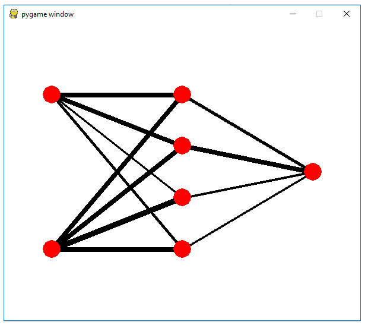

# nn-simulator
nn-simulator (nnSim) is a simulator to visualize the inner structure of Neural Network and makes it easy for students to understand how its learning works.

Currently the model of the network to visualize is limited to 3-layer network (i.e. one by one for input, hidden and output layer). 

You can change the pattern to learn from manual_setting method in network.py, which is set to XOR pattern by default and the number of units for each layer.

